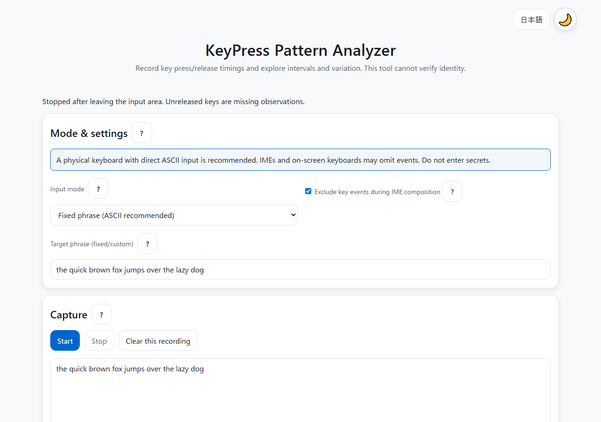
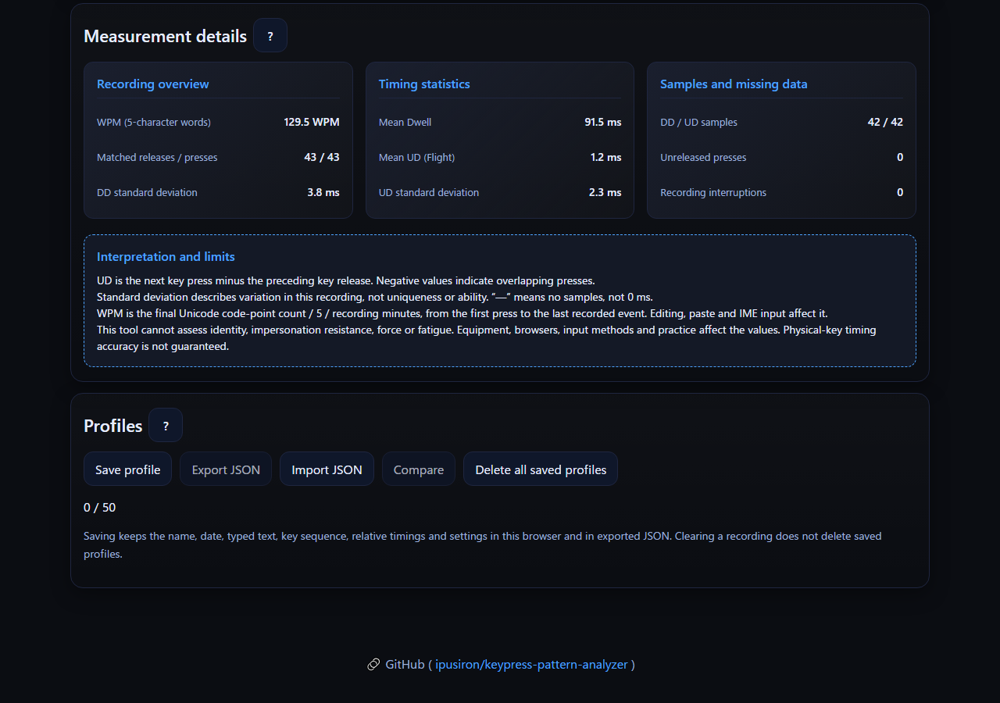

English · [日本語](README.md)

# KeyPress Pattern Analyzer - Keystroke Dynamics Analyzer


[](https://ipusiron.github.io/keypress-pattern-analyzer/)

**Day063 - 100 Security Tools with Generative AI**

KeyPress Pattern Analyzer records key press and release timings to explore intervals and variation.
It displays descriptive statistics and charts, but cannot verify identity or assess authentication security.

## 🌐 Demo

[Open in your browser](https://ipusiron.github.io/keypress-pattern-analyzer/)

This static web app computes on your device. It has no code that transmits input data.

## 📸 Screenshots

> 
>
> *English capture screen in the light theme.*

> 
>
> *English measurements and limitations in the dark theme.*

## 📖 Usage

1. Use a physical keyboard with direct ASCII input, without an IME.
2. Choose a fixed phrase, a custom phrase or free text. The fixed phrase is “the quick brown fox jumps over the lazy dog”.
3. Click Start and type in the input area.
4. Click Stop. Leaving the input area or window, or hiding the page, also stops capture.
5. Read the summary, charts, key-pair table and measurement details.
6. Save only the recordings you need as profiles and export them as JSON.

Mode and IME settings are locked during capture.
Starting again clears the current recording and results, but keeps saved profiles.
Open help with a “?” button; close it with Close or Escape.

Language precedence is `?lang=ja` or `?lang=en`, saved choice, then browser language (English unless Japanese).
Theme precedence is saved choice, then OS preference. Switching still works when storage is unavailable.

## ✨ Features

- Measurement: match presses and releases by key code and calculate Dwell, DD and signed UD (Flight).
- Statistics: means, population standard deviations, sample counts, unreleased presses, segment interruptions and WPM.
- Timeline: show matched presses and releases. Dense labels may be omitted.
- Rhythm: show DD between adjacent presses in the same segment, without smoothing or ability ratings.
- Heatmap: show counts by key value on a schematic layout. Up to 14 extra keys are drawn; the text list below contains counts for all keys.
- Digraph table: show up to 10 adjacent key pairs, sorted by frequency, with separate DD and UD sample counts.
- Profiles: save, import/export JSON, compare eligible recordings and delete all saved profiles.

Charts scroll horizontally on narrow screens.
Results are calculated when capture stops; language and theme changes keep the same recording.

## 🔬 Calculation examples and definitions

For adjacent keys A and B in press order, Dwell(A)=A↑−A↓, DD=B↓−A↓, and UD=B↓−A↑.
UD may be negative, indicating overlapping presses. [CMU definitions](https://www.cs.cmu.edu/~keystroke/)

These are synthetic event sequences. Times and metrics are in ms.

| ID | Event sequence | Dwell | DD | UD | Unreleased presses |
|---|---|---|---|---|---|
| sequential | A↓100, A↑180, B↓220, B↑300 | 80,80 | 120 | 40 | 0 |
| overlap | A↓100, B↓160, A↑200, B↑260 | 100,100 | 60 | -40 | 0 |
| single | A↓100, A↑200 | 100 | — | — | 0 |
| incomplete | A↓100, B↓160, B↑200 | 40 | 60 | — | 1 |

“—” means no samples, distinct from a mean of 0 ms.
An unreleased press is excluded from Dwell; a pair without the preceding key release is excluded from UD.
Pairs crossing IME boundaries are excluded. Auto-repeat from holding a key is ignored.

WPM is `final Unicode code-point count / 5 / (recording duration in ms / 60000)`.
Duration runs from the first press to the last recorded event, excluding the initial wait after Start.
Ten characters in 60,000 ms gives 2 WPM; empty text gives 0 WPM; zero duration gives “—”.
Editing, paste and IMEs can make character and event counts differ, so WPM is not an accuracy or ability score.

## 🔄 Comparison conditions and limits

Comparison uses cosine similarity of `[mean Dwell, mean UD, mean DD]`.
The value is not an identity probability: doubling every timing still gives 1.
Comparison is unavailable for missing observations, interrupted segments, IME use, unequal modes/target phrases/typed text, unknown conditions, unavailable metrics or zero vectors.
Also match conditions that are not recorded automatically, such as equipment and browser.

No authenticator, authentication error-rate evaluation or impersonation-resistance test is implemented.
The tool cannot determine force, fatigue or identity, and cannot serve as identity verification or proof.
Within its scope, NIST SP 800-63B-4 places conditions on biometric authentication, including use with a physical authenticator. [NIST §3.2.3](https://pages.nist.gov/800-63-4/sp800-63b.html#biometrics)

## 💾 Storage and JSON

Profiles contain a name, date, typed text, key sequence, relative timings and input settings.
They are neither encrypted nor anonymized. Take care on shared devices and when sharing JSON.
Saved profiles survive reloads; Clear this recording does not delete them.
Delete all saved profiles removes browser profiles, not downloaded JSON or data on another device.

| Limit | Maximum |
|---|---:|
| Events (presses, releases and breaks combined) | 10000 |
| Session duration from Start, in ms | 3600000 |
| Typed text and target phrase (UTF-16 code units) | 20000 |
| Profile name (UTF-16 code units) | 50 |
| Profiles | 50 |
| JSON file (bytes) | 5000000 |

All profiles are validated before import. Invalid values or excess counts cause the whole import to be rejected.
The same size limit applies to JSON containing all saved profiles together.
Metrics are recomputed from events; precomputed metrics in JSON are not trusted.
Formats without recorded input conditions are marked as unknown and cannot be compared.

Storage failure messages distinguish in-page data from persistent storage.
Export JSON before closing the page. Browser storage capacity depends on the environment.
When multiple tabs use the same site, the last save wins. Concurrent editing is not supported.

## 🎯 Use cases

- Classes and self-study: vary press/release order to observe negative UD and missing data.
- Statistics practice: type the same short phrase repeatedly and compare means with variation.
- Choosing work equipment: keep observations when comparing how keyboards feel with the same text, without rating productivity or health.
- Hobby programming: study key events, a monotonic clock, Canvas and JSON validation.
- Pilot research: inspect collection conditions and missing data using non-sensitive input with informed consent.
- Learning with an audio-level tool: compare the concepts of relative audio level in [Mic Gain Logger](https://ipusiron.github.io/mic-gain-logger/) and key-event timings. Automatic synchronization, audio analysis and integrated authentication are not implemented.

Mic Gain Logger dBFS values are device-relative, not sound pressure or key force.
Audio levels or band values do not establish a sound source or identity; no improvement in authentication accuracy is claimed.

## ⚠️ Safety and measurement limits

Do not enter passwords or personal information. Do not record others without permission or use this tool for surveillance or identifying people.
It records key events in the input area, not keystrokes outside the browser.

Timestamps come from `performance.now()` inside event handlers.
Browser timer coarsening, the OS, hardware and event-delivery delays affect observations. This is not a device for measuring physical key motion with microsecond accuracy. [W3C High Resolution Time](https://www.w3.org/TR/hr-time-3/)
IMEs and on-screen keyboards may omit events; the IME exclusion setting does not guarantee accuracy.

Input-derived strings are displayed as text.
CSP limits scripts and styles to the same origin and restricts app connections with `connect-src 'none'`.
It does not prevent fetching the page, visiting external links, browser extensions or a compromised device.
GitHub Pages meta tags cannot set frame-ancestors or X-Frame-Options, so embedding prevention is not guaranteed.

## 🔧 Troubleshooting

- No recording: check that capture started, the input area has focus, and whether an IME is active.
- “—” is shown: there are no samples for that metric. One key does not form a DD or UD pair.
- Comparison unavailable: check text/settings equality, missing observations and IME use.
- Cannot save: export JSON and check browser storage permissions and capacity.
- Import rejected: check JSON size and structure. Preserve the source data rather than forcing values to fit.
- Extension errors: they may affect behavior; isolate the issue using another browser profile.

## 📚 Technical documentation and resources

- [ALGORITHMS.md](ALGORITHMS.md): formulas and missing-data handling (Japanese).
- [TECHNICAL.md](TECHNICAL.md): measurement, comparison and distinctions from authentication research (Japanese).
- [『ハッキング・ラボで遊ぶために辞書ファイルを鍛える本』](https://akademeia.info/?page_id=22508) (Japanese-language book): creating keymap-walking dictionaries (pp. 79–87).

## 🧪 Tests

Run `npm test` with Node.js 22 or later. No dependency installation is required.
Tests cover known timing fixtures, overlaps, missing data, JSON validation, bilingual messages, README tables, HTML and colors.
GitHub Actions runs the same tests on push and pull_request.

## 📁 Directory structure

```
keypress-pattern-analyzer/          # Project root
├── .github/                        # GitHub configuration
│   └── workflows/                  # Automated tests
│       └── test.yml                # Node.js 22 CI
├── .gitignore                      # Git exclusions
├── .nojekyll                       # Disable Jekyll processing
├── index.html                      # Page structure and CSP
├── script.js                       # Capture and UI behavior
├── logic.js                        # Timing and JSON validation
├── messages.js                     # Japanese and English messages
├── theme-init.js                   # Pre-paint theme initialization
├── style.css                       # Colors and layout
├── package.json                    # Dependency-free test command
├── test/                           # Regression tests
│   ├── logic.test.js               # Known answers and boundaries
│   ├── ui.test.js                  # Messages, safety and colors
│   ├── readme.test.js              # Bilingual README checks
│   └── format.test.js              # Readable-format checks
├── README.md                       # Japanese documentation
├── README.en.md                    # English documentation
├── ALGORITHMS.md                   # Calculation details
├── TECHNICAL.md                    # Measurement versus authentication research
├── CLAUDE.md                       # Development guidance
├── LICENSE                         # MIT license
└── assets/                         # Screenshots
    ├── screenshot.png              # Japanese capture screen
    ├── screenshot2.png             # Japanese results screen
    └── en/                         # English screenshots
        ├── screenshot.png          # English capture screen
        └── screenshot2.png         # English results screen
```


## 💻 Requirements

Use a current browser with JavaScript, Canvas and dialog support.
Open index.html directly with file URLs, or use a local HTTP server.
For example: `python -m http.server 8000 --bind 127.0.0.1`.

Desktop Chromium, Edge and Firefox have been checked.
Mobile checks cover narrow layouts, not real-device key input. Safari and screen readers remain untested.

## 📄 License

MIT License. See [LICENSE](LICENSE) for details.

## 🛠️ About this tool

This tool is part of the “100 Security Tools with Generative AI” project.
The project creates and publishes security-related tools over 100 days with AI assistance.

For project details and other tools, visit:

🔗 [100 Security Tools with Generative AI](https://akademeia.info/?page_id=42163)
