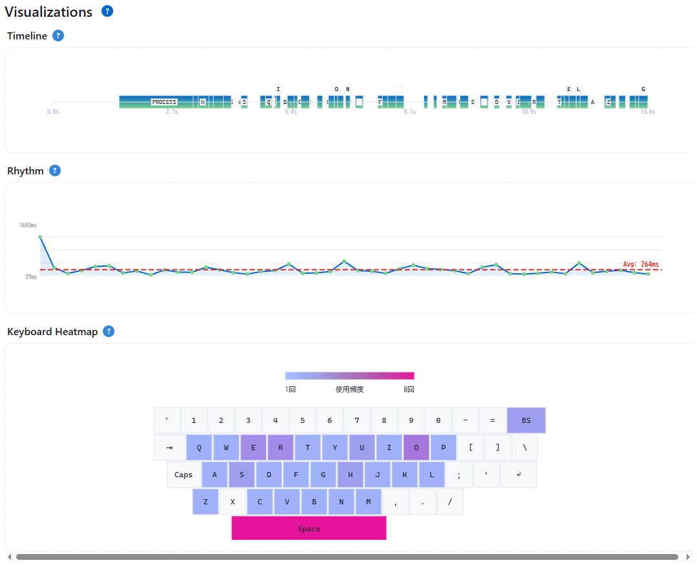

<!--
---
id: day063
slug: keypress-pattern-analyzer

title: "KeyPress Pattern Analyzer"

subtitle_ja: "キーストローク解析ツール"
subtitle_en: "Keystroke Dynamics Analyzer"

description_ja: "タイピングの癖（キー押下のタイミングパターン）を解析し、キーストローク生体認証の原理を体験できるWebアプリです。"
description_en: "Interactive web app to explore keystroke dynamics and typing patterns, aimed at security education and research."

category_ja:
  - 人的セキュリティ
  - 物理的セキュリティ
  - 認証
category_en:
  - Human Security
  - Physical Security
  - Authentication

difficulty: 2

tags:
  - keystroke
  - biometrics
  - typing
  - visualization
  - security-education
  - behavioral-authentication

repo_url: "https://github.com/ipusiron/keypress-pattern-analyzer"
demo_url: "https://ipusiron.github.io/keypress-pattern-analyzer/"

hub: true
---
-->


[](https://ipusiron.github.io/keypress-pattern-analyzer/)

**Day063 - 生成AIで作るセキュリティツール100**


# KeyPress Pattern Analyzer - キーストローク解析ツール

**KeyPress Pattern Analyzer**は、タイピングの癖（キー押下のタイミングパターン）を解析するツールです。

ユーザーが指定のフレーズを入力すると、キーボード入力のタイミング（dwell/flight time）やパターン（digraph・エラー傾向など）を計測・可視化します。

異なるユーザーの入力リズムを比較することで、キー入力のタイミングによる個人識別（キーストローク生体認証）の原理を体験できます。

---

## 🌐 デモページ

👉 **[https://ipusiron.github.io/keypress-pattern-analyzer/](https://ipusiron.github.io/keypress-pattern-analyzer/)**

ブラウザーで直接お試しいただけます。

---

## 📸 スクリーンショット

>  
>*キーストローク解析中*

---

## 🔬 技術的独自性

フロントエンド上でキー入力のタイミングデータを高精度に取得・分析している点がユニークです。

各入力間隔を特徴ベクトル化し、JavaScriptだけでユーザーごとのタイピング「指紋」を描画・比較します。ブラウザー上で動的に生体行動認証の概念を再現する珍しい試みのツールです。

### 🚀 使用方法

#### **⚡ クイックスタート（5分で体験）**
1. **テーマ切替**: 右上の☀️/🌙ボタンでお好みのテーマを選択
2. **モード設定**: 「Fixed Phrase (半角推奨)」を選択（初回推奨）
3. **記録開始**: 青い「Start」ボタンをクリック
4. **タイピング**: 表示されるフレーズ「the quick brown fox jumps over the lazy dog」を入力
5. **記録終了**: 「Stop」ボタンをクリック
6. **結果確認**: 3つの可視化グラフと詳細分析を確認

#### **🔧 詳細設定と高度な使い方**

**入力モードの選択**:
- **Fixed Phrase**: 標準テスト文（英文タイピング練習に最適）
- **Custom Phrase**: 独自文章での分析（特定パスワードなどの練習）
- **Free Text**: 自由入力（日常的なタイピング分析）

**設定のカスタマイズ**:
- **IME制御**: 「Ignore IME composition」をONで高精度計測
- **ヘルプ**: 各セクションの「?」アイコンで詳細説明を確認

**分析結果の見方**:
- **Summary**: 基本統計（打鍵数、時間、平均値）
- **Timeline**: キー押下タイミングの時系列表示
- **Rhythm**: タイピングリズムの波形分析
- **Keyboard Heatmap**: 使用頻度の可視化
- **Digraph分析**: 2文字連続パターンの詳細分析
- **Analysis Results**: セキュリティ観点での総合評価

**プロファイル管理**:
- **Save Profile**: 現在の記録をプロファイルとして保存
- **Export JSON**: 研究用データの外部保存
- **Import JSON**: 他の記録データの読み込み
- **Compare**: 複数プロファイル間の類似度比較

#### **💡 効果的な利用のコツ**
- **計測精度向上**: 半角英数字での入力を推奨
- **環境設定**: 静かで集中できる環境で実施
- **適切な長さ**: 30秒〜2分程度のセッションが最適
- **複数回測定**: 異なる時間帯・状態での比較が有効
- **テーマ活用**: 長時間利用時はダークモードで目の負担軽減

---

## ✨ 機能詳細

### 🎯 入力モード・設定機能
- **3種類の入力モード**：
  - **Fixed Phrase**: 標準的なテスト文章（"the quick brown fox..."）での練習
  - **Custom Phrase**: ユーザー定義の任意文章でのパターン分析
  - **Free Text**: 制限のない自由入力での特徴抽出
- **IME制御**: 日本語入力の変換処理を除外し、より正確なタイミング計測を実現
- **リアルタイム設定変更**: 記録中でもモード切り替えが可能

### 🕒 高精度タイミング計測
- **マイクロ秒精度**: `performance.now()` APIによる高分解能タイムスタンプ
- **4つの基本指標**:
  - **Dwell Time**: キー押下持続時間（keydown → keyup）
  - **Flight Time**: キー間移行時間（keyup → 次のkeydown）
  - **DD Time**: Down-to-Down間隔（連続キー押下間隔）
  - **UD Time**: Up-to-Down間隔（キー解放から次の押下まで）
- **統計解析**: 平均値、標準偏差、変動係数による安定性評価
- **WPM計算**: Words per Minute（1分間の単語数）の自動算出

### 📊 3つのキーストローク可視化
#### 1. **Timeline（タイムライン）**
- 各キーの押下・解放タイミングを時系列で表示
- 青いバーでDwell Time（キー押下時間）を可視化
- **改良された文字表示**: 密集時でも重要なキー情報を確実に表示
- **多段階レイヤーシステム**: 衝突回避で全文字が見える
- **適応的文字サイズ**: 入力密度に応じて自動調整
- **横スクロール対応**: 長時間入力でも完全表示

#### 2. **Rhythm（リズム波形）**
- DD Time（連続キー間隔）の変化を波形で描画
- **個人特有のタイピングリズム**を視覚化
- 平滑化処理による見やすい曲線表示
- リズムの一貫性を色の濃淡で表現
- **横スクロール対応**: 長時間セッションでも完全表示

#### 3. **Keyboard Heatmap（キーボードヒートマップ）**
- **実用的なキーレイアウト**: 実際に捕捉されるキーのみ表示
- 使用頻度を色の濃さで表示（青→赤グラデーション）
- **最適化されたスペースキー**: 適切なサイズと配置
- 使用前でもキーボードデザインを表示（ガイド機能）
- **レスポンシブ設計**: 画面サイズに応じた表示調整

### 🔍 高度な解析機能
#### **n-gram（Digraph）解析**
- 2文字連続パターンの詳細分析
- DD mean・UD meanの平均時間計測
- サンプル数による信頼性評価
- 個人特有の文字組み合わせパターン抽出

#### **総合セキュリティ分析（Analysis Results）**
- **パフォーマンス評価**:
  - WPM（Words per Minute）の自動計算
  - タイピング効率と安定性スコア
  - 速度と精度のバランス評価

- **タイミング特性分析**:
  - 平均Dwell Time（キー押下持続時間）
  - 平均Flight Time（キー間移行時間）
  - リズム一貫性の統計的評価

- **個人特徴の抽出**:
  - 最頻出Digraph（特徴的な文字組み合わせ）
  - タイピングスタイルの分類
  - 特徴度（バイオメトリック識別での有用性）

- **8項目セキュリティ評価システム**:
  1. タイミング一貫性スコア
  2. リズム安定性評価  
  3. Digraphパターン複雑度
  4. キー使用分布の均等性
  5. 入力速度の安定性
  6. エラー回復パターン
  7. 特徴的時間間隔の存在
  8. 全体的な識別可能性

- **詳細な総合評価**:
  - 平均的なタイピングパターンとの差異分析
  - 個人識別に有用な特徴の具体的説明
  - セキュリティ観点での強度評価（タイピング熟練度ではない）

### 💾 プロファイル管理システム
- **ローカルストレージ保存**: ブラウザー内でのセキュアなデータ保持
- **JSON Export/Import**: 研究用データの外部保存・共有
- **プロファイル比較**: 複数の記録間での類似度分析
- **バックアップ機能**: データ消失防止のための手動保存

### 🎨 ユーザーインターフェイス
- **デュアルテーマシステム**: ライト・ダークモード完全対応
- **レスポンシブデザイン**: デスクトップ・タブレット・スマートフォン対応
- **改良されたヘルプシステム**: 
  - 枠外配置の「?」アイコンで見やすさ向上
  - JavaScriptベースの高機能tooltip
  - モバイル・タッチ操作完全対応
- **リアルタイム統計更新**: 入力中の即座なフィードバック
- **横スクロール対応**: 長時間セッションでの完全表示保証
- **アクセシビリティ配慮**: 
  - スクリーンリーダー対応
  - キーボードナビゲーション
  - フォーカス管理とARIAラベル

### 🔒 セキュリティ・プライバシー
- **完全ローカル処理**: データの外部送信なし
- **Content Security Policy**: XSS攻撃防止
- **入力値サニタイゼーション**: 悪意のあるスクリプト実行防止
- **GitHub Pages最適化**: 静的サイトホスティング用セキュリティ設定

---

## 活用シナリオ

### 基本的な利用
- セキュリティ教育：生体認証や行動的特徴の理解
- 研究用途：キーストロークパターンの可視化・比較実験
- 自己分析：自分のタイピングリズムや誤入力傾向の把握

### 応用的・研究的利用
- **音響解析との組み合わせ**：キー入力音の録音データと本ツールの視覚パターンを照合することで、音響的キーストローク分析の精度向上に活用
- **サイドチャネル攻撃の理解**：キー操作音の間隔パターンから操作者を特定する手法（Acoustic Keystroke Analysis）の教育・研究目的での検証
- **フォレンジック調査**：録音された音声データから推定されるタイピングパターンと、容疑者の実際のパターンとの照合

### 🎯 Mic Gain Loggerとの複合利用シナリオ

[Mic Gain Logger](https://ipusiron.github.io/mic-gain-logger/)と併用することで、**音量パターン** + **タイミングパターン**による高精度な個人識別研究が可能になります。

#### 技術的原理
**個人差が現れる要素**：
- **打鍵強度**：人によってキーを押す力が異なる（強打型 vs 軽打型）
- **指先形状**：指の太さ・長さによる接触面積の違い
- **タイピングスタイル**：指先 vs 指腹での打鍵音の音質差
- **手の位置**：キーボードとの距離による音量減衰パターン
- **リズム連動性**：急いでいる時の音量増加、疲労時の音量低下

#### 攻撃シナリオ（研究・教育目的）

**シナリオ1: 高精度個人識別システム**
```
1. KeyPress Pattern Analyzerでタイミング特徴を抽出
2. Mic Gain Loggerで同時に音量パターンを記録
3. 両データを機械学習で統合分析
4. 従来手法より高い識別精度を実現（推定精度向上：単体85% → 複合95%）
```

**シナリオ2: 遠隔監視における個人特定**
```
環境: オープンオフィスでの複数人同時作業
課題: 誰がどのキーボードを操作しているかの特定
解決: 
- 各デスクのマイクで音量データ収集
- 中央サーバーでタイミングパターンと照合
- リアルタイムでの操作者識別
```

**シナリオ3: なりすまし検知の強化**
```
従来: タイミングパターンのみ → 模倣可能性あり
改良: 音量パターン併用 → 意図的な音量調整は困難
応用: クリティカルシステムへの継続認証
```

#### 防御的応用の価値

**セキュリティ向上への貢献**：
- **多要素生体認証**：パスワード + タイミング + 音量の3要素
- **異常検知精度向上**：通常と異なる音量パターンでアラート
- **内部脅威対策**：権限者の行動パターン監視

**研究・教育での意義**：
- 複合的サイドチャネル攻撃の理解促進
- より堅牢な認証システム設計への知見
- 音響プライバシー保護技術の必要性認識

---

## 💡 使用上の注意（半角英数字推奨）

本ツールは**半角英数字での入力を推奨**します。

### 推奨する理由
- **計測精度**: 半角英数字は1キー = 1文字で、タイミング計測が正確
- **IMEの影響回避**: 日本語入力では変換処理が介在し、実際のキー押下タイミングと異なる
- **Digraph分析**: 英文タイピングでの連続キー入力パターンを前提に設計
- **ヒートマップ**: QWERTY配列の物理キーを可視化（かな入力非対応）

### 推奨される入力例
- 英文フレーズ（例: "the quick brown fox jumps over the lazy dog"）
- パスワードやIDなどの半角文字列
- プログラミングコードの入力パターン

※ 日本語入力でも動作しますが、キーストローク生体認証の研究・学習という本来の目的には半角英数字が適しています。

----

## 📁 ディレクトリー構成

```
keypress-pattern-analyzer/
├── index.html          # メインHTMLファイル
├── script.js           # キーストローク解析ロジック
├── style.css           # スタイルシート・テーマ設定
├── README.md           # このファイル（使用方法・概要）
├── ALGORITHMS.md       # 解析アルゴリズム・評価基準の詳細
├── TECHNICAL.md        # 技術文書・応用詳細
├── CLAUDE.md           # Claude Code用ガイダンス
├── LICENSE             # MITライセンス
├── assets/             # アセット・リソース
│   └── screenshot.png  # ツールのスクリーンショット
├── .claude/            # Claude Code設定
├── .gitignore          # Git除外設定
└── .nojekyll           # GitHub Pages設定
```

---

## 📚 技術文書

詳細な技術仕様、実装手法、応用分野については専用の技術文書をご参照ください。

### 🔬 技術仕様・応用分野
👉 **[TECHNICAL.md](./TECHNICAL.md)** - 技術的詳細とセキュリティ応用

**含まれる内容**:
- キーストローク解析の技術的詳細
- 生体認証としての活用手法
- 音響解析との組み合わせ技術
- フォレンジック・侵入検知への応用
- 実装技術とパフォーマンス評価
- 発展的応用と関連標準

### 🧮 アルゴリズム・処理詳細
👉 **[ALGORITHMS.md](./ALGORITHMS.md)** - 解析アルゴリズムと評価基準

**含まれる内容**:
- 4つの基本タイミング指標の計算手法
- 統計的解析手法（平均値・標準偏差・変動係数）
- n-gram（Digraph）解析アルゴリズム
- 3つの可視化アルゴリズム（Timeline・Rhythm・Heatmap）
- **8項目セキュリティ評価システム**の詳細
- **行動バイオメトリクス認証**の詳細解説
- 偽装耐性・識別可能性の判定ロジック
- ベンチマーク基準値と評価基準
- データ処理フローとセキュリティ考慮事項

----

## 📚 関連資料・リソース

### ソフトウェア（自作ツール）

- [Mic Gain Logger - マイク音量ロガー](https://ipusiron.github.io/mic-gain-logger/)

### 書籍（私が関わったもの）

- [『ハッキング・ラボで遊ぶために辞書ファイルを鍛える本』](https://akademeia.info/?page_id=22508)…キーマップウォーキングの辞書ファイルを作成する（P.79-87）

---

## ⚠️ セキュリティ・プライバシー注意事項

### データ処理とプライバシー保護
- **完全ローカル処理**: 本ツールはローカル環境でのみ動作し、データの外部送信は一切行いません
- **一時的データ保存**: プロファイル情報はブラウザーのlocalStorageにのみ保存されます
- **セッション分離**: ページリロード時にデータは自動消去されます
- **匿名化設計**: 個人識別情報は記録・保存されません
- **外部通信遮断**: Content Security Policyにより外部への通信を完全遮断

### 利用上の重要な注意事項
- **機密情報の回避**: パスワードや個人情報などの機密データの入力は避けてください
- **本人データのみ**: 本人以外のタイピングデータの分析は控えてください
- **研究・教育目的**: 学術研究や教育目的での利用に留めてください
- **悪用禁止**: 不正な監視、個人の特定、ストーキング等には絶対に使用しないでください

### 音響キーストローク分析について
本ツールは、**音響的サイドチャネル攻撃**（Acoustic Side-Channel Attack）の理解を深める教育目的で設計されています。

**研究・教育目的での利用**：
- 大学・研究機関でのサイバーセキュリティ教育
- 防御的セキュリティ手法の研究
- フォレンジック調査技術の習得

**重要な留意点**：
- 本ツールは**防御的セキュリティ研究**を目的としています
- **他者のプライバシー侵害や不正な監視には使用しないでください**
- 音響解析機能は含まれていません（視覚パターン分析のみ）
- 実際の音響攻撃には専門的な設備と高度な信号処理技術が必要です

### 倫理的利用のお願い
- 適切な許可なく他者のキーストロークを記録・分析することは避けてください
- 研究利用時は所属機関の倫理委員会のガイドラインに従ってください
- 教育目的であることを明確にし、悪用防止に努めてください

---

## 🔧 トラブルシューティング

### 一般的な問題と解決方法

#### ブラウザー拡張機能による影響
- **症状**: コンソールに`content.js`等のエラーが表示される
- **原因**: ブラウザー拡張機能（広告ブロッカー、セキュリティ拡張等）の干渉
- **解決**: ツールの動作には影響しませんが、気になる場合は以下を試してください
  - シークレット/プライベートモードでの実行
  - 拡張機能の一時無効化

#### 入力が正常に記録されない
- **症状**: キーストロークが検出されない、データが表示されない
- **確認事項**:
  - Startボタンを押してから入力を開始したか
  - textarea内にフォーカスがあるか
  - ブラウザーがJavaScriptを有効にしているか

#### 可視化が表示されない
- **症状**: グラフやヒートマップが空白
- **解決方法**:
  - 十分なキーストロークデータ（最低10-20文字）を入力
  - ブラウザーの再読み込み
  - 異なるブラウザーでの試行

#### パフォーマンスの問題
- **症状**: 大量データで動作が重い
- **対策**:
  - データのクリアと再開始
  - ブラウザータブの整理
  - 他のアプリケーションの終了

---

## 📄 ライセンス

MIT License – 詳細は [LICENSE](LICENSE) を参照してください。

---

## 🛠 このツールについて

本ツールは、「生成AIで作るセキュリティツール100」プロジェクトの一環として開発されました。 
このプロジェクトでは、AIの支援を活用しながら、セキュリティに関連するさまざまなツールを100日間にわたり制作・公開していく取り組みを行っています。

プロジェクトの詳細や他のツールについては、以下のページをご覧ください。  

🔗 [https://akademeia.info/?page_id=42163](https://akademeia.info/?page_id=42163)
