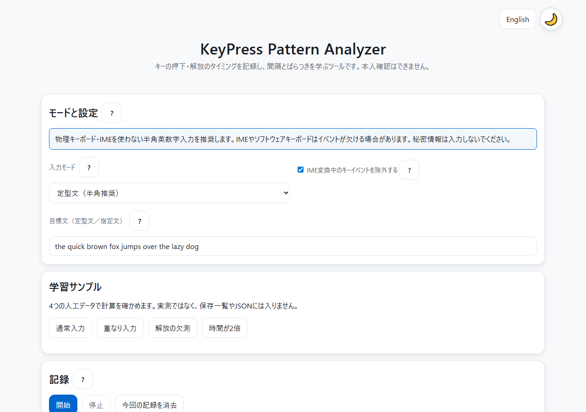
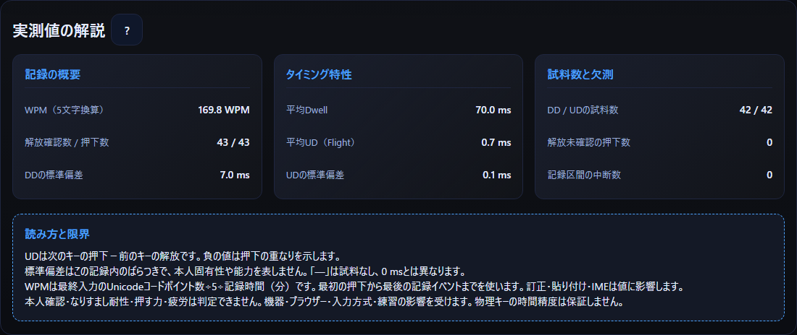

<!--
---
id: day063
slug: keypress-pattern-analyzer

title: "KeyPress Pattern Analyzer"

subtitle_ja: "キーストローク解析ツール"
subtitle_en: "Keystroke Dynamics Analyzer"

description_ja: "タイピングの癖（キー押下のタイミングパターン）を解析し、キーストローク生体認証の原理を体験できるWebアプリです。"
description_en: "Interactive web app to explore keystroke dynamics and typing patterns, aimed at security education and research."

category_ja:
  - 人的セキュリティ
  - 物理的セキュリティ
  - 認証
category_en:
  - Human Security
  - Physical Security
  - Authentication

difficulty: 2

tags:
  - keystroke
  - biometrics
  - typing
  - visualization
  - security-education
  - behavioral-authentication

repo_url: "https://github.com/ipusiron/keypress-pattern-analyzer"
demo_url: "https://ipusiron.github.io/keypress-pattern-analyzer/"

hub: true
---
-->

[English](README.en.md) · 日本語

# KeyPress Pattern Analyzer - キーストローク解析ツール


[](https://ipusiron.github.io/keypress-pattern-analyzer/)

**Day063 - 生成AIで作るセキュリティツール100**

KeyPress Pattern Analyzerは、キーの押下と解放のタイミングを記録し、間隔とばらつきを学ぶツールです。
記述統計とグラフを表示しますが、本人確認や認証の安全性は判定できません。

## 🌐 デモページ

[ブラウザーで開く](https://ipusiron.github.io/keypress-pattern-analyzer/)

端末内で計算する静的Webアプリです。入力データを送信する処理はありません。

## 📸 スクリーンショット

> 
>
> *日本語、ライト配色の入力画面。*

> 
>
> *日本語、ダーク配色の実測値と限界の説明。*

## 📖 使い方

1. 物理キーボードを使い、IMEを使わない半角英数字入力にする。
2. 定型文、指定文、自由入力のいずれかを選ぶ。定型文は「the quick brown fox jumps over the lazy dog」。
3. 「開始」を押し、入力欄に文章を打つ。
4. 「停止」を押す。入力欄やウィンドウから離れた場合、ページが非表示になった場合も停止する。
5. 概要、グラフ、2キー組、実測値の解説を読む。
6. 必要な記録だけプロファイルへ保存し、JSONで書き出す。

計測中はモードとIME設定を変更できません。
再開始は今回の記録と結果を消去しますが、保存済みプロファイルは保持します。
ヘルプは「?」ボタンで開き、閉じるボタンまたはEscapeで閉じます。

言語は `?lang=ja` または `?lang=en`、保存した選択、ブラウザーの言語の順に決まります（日本語以外は英語）。
配色は保存した選択、OSの設定の順に決まり、保存が使えなくても切り替えられます。

## ✨ 機能詳細

- 計測：押下と解放をキーコードで対応させ、Dwell、DD、符号つきUD（Flight）を計算
- 統計：平均、母標準偏差、試料数、解放未確認数、区間の中断数、WPM
- タイムライン：対応する押下と解放を表示。密集したラベルは省略される場合あり
- リズム：同一区間の隣接押下間隔DDを表示。平滑化や能力の採点はしない
- ヒートマップ：キー値別の使用回数を模式的な配列へ表示。追加キーは先頭14種まで描画し、下の一覧に全種の回数を表示
- Digraph表：押下順の2キー組を頻度順に最大10組表示。DDとUDの試料数を別々に表示
- プロファイル：保存、JSON読込と出力、条件を確認した比較、保存プロファイルの全削除

グラフは狭い画面で横にスクロールできます。
結果は停止時に計算し、言語や配色を切り替えても同じ記録を表示します。

## 🔬 計算例と定義

押下順で隣り合うキーをA、Bとすると、Dwell(A)=A↑−A↓、DD=B↓−A↓、UD=B↓−A↑です。
UDは負になることがあり、押下の重なりを示します。[CMUの定義](https://www.cs.cmu.edu/~keystroke/)

以下は人工イベント列です。時刻と各指標の単位はmsです。

| ID | イベント列 | Dwell | DD | UD | 解放未確認数 |
|---|---|---|---|---|---|
| sequential | A↓100, A↑180, B↓220, B↑300 | 80,80 | 120 | 40 | 0 |
| overlap | A↓100, B↓160, A↑200, B↑260 | 100,100 | 60 | -40 | 0 |
| single | A↓100, A↑200 | 100 | — | — | 0 |
| incomplete | A↓100, B↓160, B↑200 | 40 | 60 | — | 1 |

試料なしは「—」で、平均0msとは区別します。
解放が確認できない押下はDwellに含めず、前のキーの解放が不明な組はUDに含めません。
IMEの境界をまたぐ組は計算しません。長押しのリピートは除外します。

WPMは `最終入力のUnicodeコードポイント数 / 5 / (記録時間ms / 60000)` です。
時間は最初の押下から最後の記録イベントまでで、開始後の待ち時間は含めません。
10文字を60,000msで入力すると2WPM、空文字なら0WPM、時間が0なら「—」です。
訂正、貼り付け、IMEで文字数とイベント数は一致しないため、正確性や能力の点数ではありません。

## 🔄 比較の条件と限界

比較は `[平均Dwell, 平均UD, 平均DD]` のコサイン類似度です。
値は本人一致率ではありません。すべての時間を2倍にしても1になります。
欠測、区間の中断、IME使用、モードや目標文や入力本文の不一致、条件不明、必要な指標なし、ゼロベクトルでは比較しません。
機器やブラウザーなど、自動では記録していない条件も利用者がそろえてください。

認証器、認証誤り率の評価、なりすまし耐性の検査は実装していません。
押す力、疲労、人物の特定もできず、本人確認や証明には使えません。
NIST SP 800-63B-4の適用範囲では、生体情報の認証利用に物理的な認証器との組み合わせなどの条件があります。[NIST §3.2.3](https://pages.nist.gov/800-63-4/sp800-63b.html#biometrics)

## 💾 保存とJSON

保存するのは名前、日時、入力本文、キー列、相対時刻、入力設定です。
暗号化や匿名化はしていません。共有端末やJSONの共有には注意してください。
保存プロファイルは再読み込み後も残ります。「今回の記録を消去」では削除されません。
「保存プロファイルを全削除」はブラウザー内のプロファイルを消し、ダウンロード済みJSONや別の端末のデータは消しません。

| 制限 | 上限 |
|---|---:|
| イベント（押下、解放、中断の合計） | 10000 |
| 1回の時間（開始操作から、ms） | 3600000 |
| 入力本文と目標文（UTF-16コード単位） | 20000 |
| プロファイル名（UTF-16コード単位） | 50 |
| プロファイル数 | 50 |
| JSONファイル（バイト） | 5000000 |

JSONは全件を検証してから取り込みます。不正な値や件数超過があれば全体を拒否します。
保存プロファイル全体をJSONにしたサイズにも同じ上限を適用します。
指標はイベント列から再計算し、JSON内の計算済み指標は信頼しません。
入力条件が記録されていない形式は条件不明として扱い、比較対象にしません。

保存に失敗した場合は画面内の記録と永続保存を区別して通知します。
画面を閉じる前にJSONを出力してください。ブラウザー内の保存容量は環境に依存します。
同じサイトを複数タブで開くと、最後の保存が残ります。同時編集には対応していません。

## 🎯 ユースケース

- 授業と自習：押下と解放の順序を変え、負のUDや欠測を観察
- 統計の練習：同じ短文を複数回入力し、平均とばらつきの違いを確認
- 仕事の道具選び：同じ文章でキーボードの入力感を比較する際の観察メモ。生産性や健康の評価にはしない
- 趣味のプログラミング：キーイベント、単調時計、Canvas、JSON検証の実装例を読む
- 研究の予備実験：本人の同意を得た非機密の入力で、収集条件と欠測を点検
- 音量ツールとの学習：[Mic Gain Logger](https://ipusiron.github.io/mic-gain-logger/)の相対音量と打鍵時刻の違いを学ぶ。自動同期、音声解析、統合認証は未実装

Mic Gain LoggerのdBFSは端末依存の相対値で、音圧や押す力ではありません。
音量や帯域値から音源や人物を断定せず、認証精度の向上を示す数値もありません。

## ⚠️ 安全性と計測の限界

パスワードや個人情報は入力しないでください。他者の入力を無断で記録せず、監視や人物の特定に使用しないでください。
本ツールが記録するのは入力欄のキーイベントで、ブラウザー外のキー操作は記録しません。

時刻はイベントハンドラー内の `performance.now()` です。
ブラウザーによる時間分解能の粗化、OS、機器、イベント配送の遅延を含むため、物理キーの動きをマイクロ秒精度で測る装置ではありません。[W3C High Resolution Time](https://www.w3.org/TR/hr-time-3/)
IMEやソフトウェアキーボードではイベントが省略される場合があり、IME除外設定は正確さを保証しません。

入力由来の文字列はテキストとして表示します。
CSPでスクリプトとスタイルを同一配信元に限定し、アプリからの通信は `connect-src 'none'` で制限します。
ページの取得や外部リンクの閲覧まで止めるものではなく、拡張機能や端末の侵害も防げません。
GitHub Pagesのmetaではframe-ancestorsやX-Frame-Optionsを設定できず、埋め込み拒否は保証しません。

## 🔧 トラブルシューティング

- 記録されない：開始したか、入力欄にフォーカスがあるか、IMEが有効かを確認
- 「—」が出る：その指標の試料がない。1キーだけではDDやUDの組はない
- 比較できない：入力文や設定の一致、欠測、IME使用を確認
- 保存できない：JSONを出力し、ブラウザーの保存権限と容量を確認
- 読込を拒否される：JSONのサイズと形式を確認。元データを保管し、無理に値を書き換えない
- 拡張機能のエラー：影響がないとは断定できないため、別のブラウザープロファイルなどで切り分け

## 📚 技術文書と関連資料

- [ALGORITHMS.md](ALGORITHMS.md)：計算式と欠測の扱い
- [TECHNICAL.md](TECHNICAL.md)：計測、比較、認証研究との区別
- [『ハッキング・ラボで遊ぶために辞書ファイルを鍛える本』](https://akademeia.info/?page_id=22508)：キーマップウォーキングの辞書作成（P.79-87）

## 🧪 テスト

Node.js 22以上で `npm test` を実行します。依存パッケージのインストールは不要です。
計測の既知解答、重なり、欠測、JSON検証、日英辞書、READMEの数値表、HTMLと配色をテストします。
GitHub Actionsでもpushとpull_requestに対して同じテストを実行します。

## 📁 ディレクトリー構造

```
keypress-pattern-analyzer/          # プロジェクトルート
├── .github/                        # GitHub設定
│   └── workflows/                  # 自動テスト
│       └── test.yml                # Node.js 22のCI
├── .gitignore                      # Git除外設定
├── .nojekyll                       # Jekyll処理を無効化
├── index.html                      # 画面構造とCSP
├── script.js                       # 記録と画面操作
├── logic.js                        # 計測とJSON検証
├── messages.js                     # 日英辞書
├── theme-init.js                   # 描画前の配色設定
├── style.css                       # 配色とレイアウト
├── package.json                    # 依存なしのテスト設定
├── test/                           # 回帰テスト
│   ├── logic.test.js               # 既知解答と境界値
│   ├── ui.test.js                  # 辞書と安全性と配色
│   ├── readme.test.js              # 日英READMEの検算
│   └── format.test.js              # 非圧縮の書式を検査
├── README.md                       # 日本語の説明
├── README.en.md                    # 英語の説明
├── ALGORITHMS.md                   # 計算の詳細
├── TECHNICAL.md                    # 計測と認証研究の区別
├── CLAUDE.md                       # 開発規則
├── LICENSE                         # MITライセンス
└── assets/                         # 画面画像
    ├── screenshot.png              # 日本語の入力画面
    ├── screenshot2.png             # 日本語の結果画面
    └── en/                         # 英語の画面画像
        ├── screenshot.png          # 英語の入力画面
        └── screenshot2.png         # 英語の結果画面
```


## 💻 動作環境

JavaScript、Canvas、dialogに対応する現行ブラウザーで使います。
index.htmlを直接開くfile方式と、ローカルHTTP配信に対応しています。
HTTP配信例は `python -m http.server 8000 --bind 127.0.0.1` です。

Chromium、Edge、Firefoxのデスクトップ環境で確認しています。
スマートフォンは狭幅表示を確認したもので、実機のキー入力、Safari、スクリーンリーダーは未検証です。

## 📄 ライセンス

MIT License。詳細は[LICENSE](LICENSE)を参照してください。

## 🛠️ このツールについて

本ツールは、「生成AIで作るセキュリティツール100」プロジェクトの一環として開発されました。
このプロジェクトでは、AIの支援を活用しながら、セキュリティに関連するさまざまなツールを100日間にわたり制作、公開していく取り組みを行っています。

プロジェクトの詳細や他のツールについては、以下のページをご覧ください。

🔗 [生成AIで作るセキュリティツール100](https://akademeia.info/?page_id=42163)
